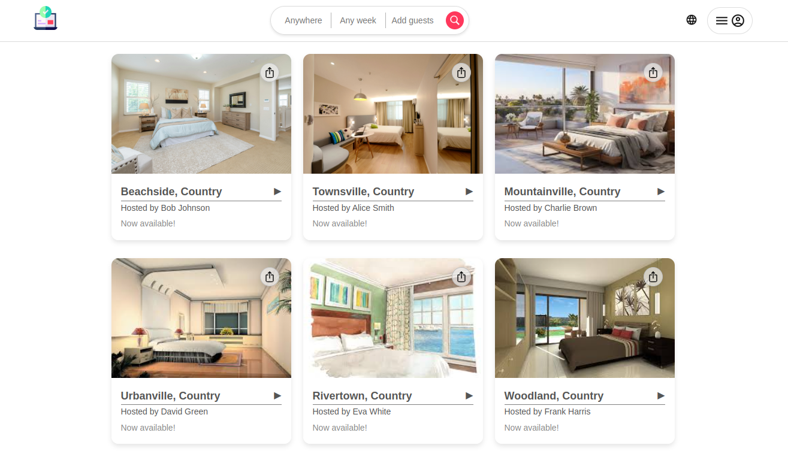
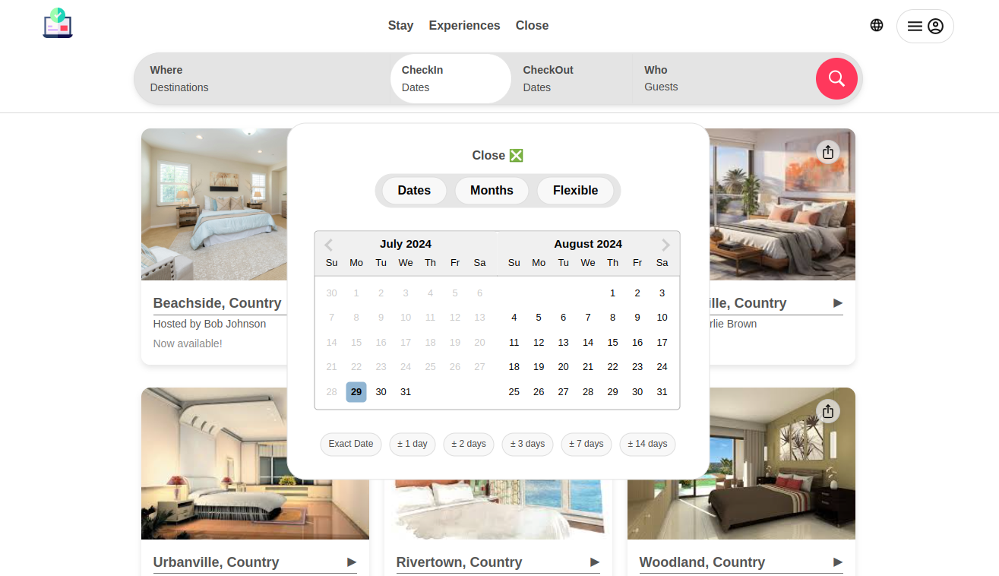
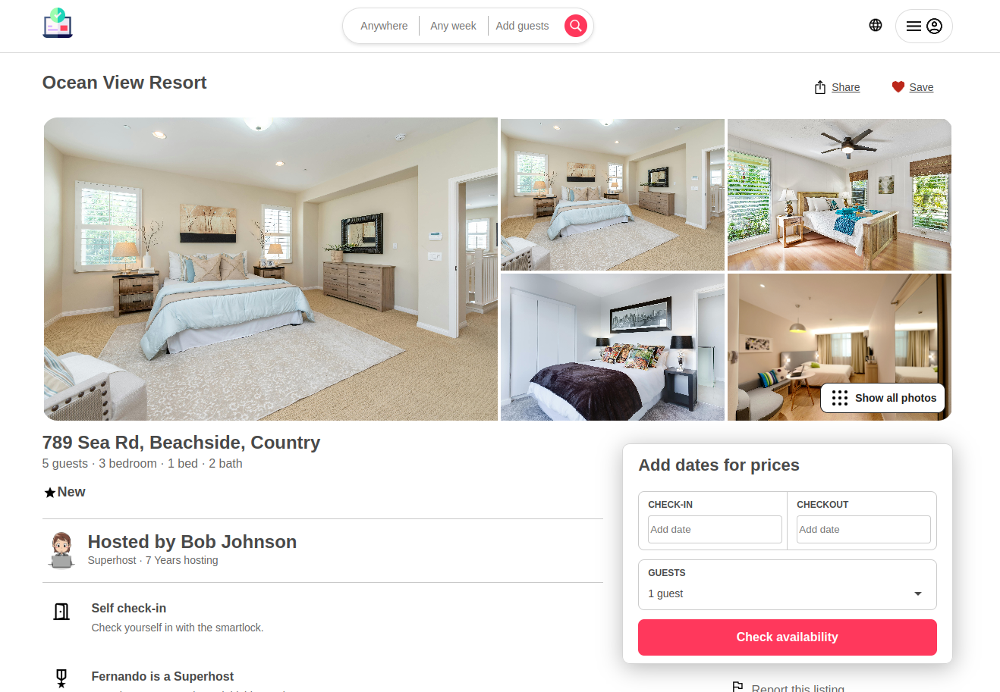
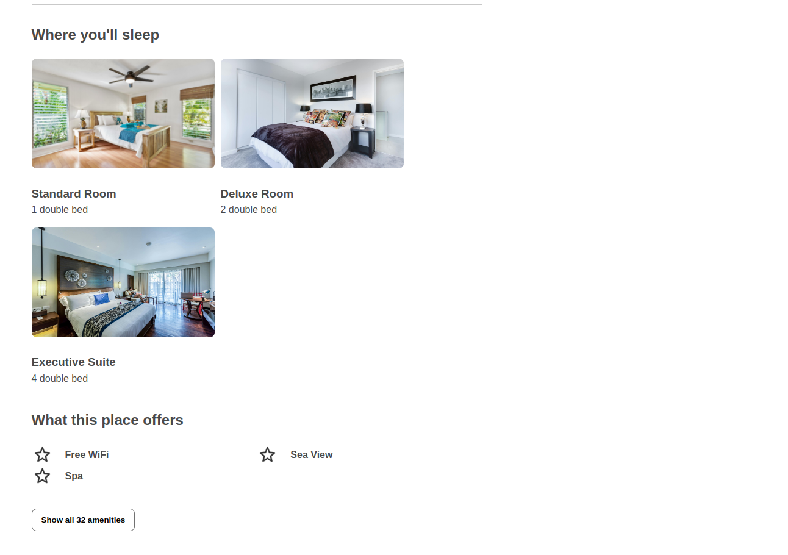

# Hotel Management System Frontend

## Assignment on NodeJS, ReactJS, PostgresSQL

This project is a frontend application for managing hotel and room details using Node.js, Express.js, and PostgreSQL.

## [**Backend Link🔗**](https://github.com/imrancse190/Backend-ReactJS-NodeJS-Assignment)

## Table of Contents

- [Getting Started](#getting-started)
- [Prerequisites](#prerequisites)
- [Installation](#installation)
- [Running the Application](#running-the-application)
- [Building the Application](#building-the-application)
- [Testing the Application](#testing-the-application)
- [Project Structure](#project-structure)
- [Dependencies](#dependencies)
- [Screensorts](#screensorts)
- [Additional Information](#additional-information)

## Getting Started

Follow these instructions to set up and run the project on your local machine.

## Prerequisites

- [Node.js](https://nodejs.org/)
- [npm](https://www.npmjs.com/)

## Installation

1. **Clone the repository:**

   ```sh
   git clone https://github.com/imrancse190/Frontend-ReactJS-NodeJS-Assignment
   cd Frontend-ReactJS-NodeJS-Assignment
   ```

2. **Install dependencies:**

   ```sh
   npm install
   ```

## Running the Application

1. **Start the development server:**

   ```sh
   npm start
   ```

2. **The application will run on `http://localhost:3006`.**

   <b>Note:</b> The backend application run on the **`http://localhost:3000`**. You should run the frontend application rather then the port 3000.

## Building the Application

1. **Create a production build:**

   ```sh
   npm run build
   ```

2. **The production-ready files will be in the `build` directory.**

## Testing the Application

1. **Run tests:**

   ```sh
   npm test
   ```

## Project Structure

The project structure is as follows:

```
assignment4-frontend/
├── node_modules/
├── public/
│   ├── assets
|   |   ├── icon
|   |   |   ├── place_offers
|   |   |   └── ...
|   |   └── images
|   |       └── ...
│   ├── favicon.ico
|   ├── index.html
│   └── ...
├── src/
│   ├── components/
│   │   └── ...
│   ├── config/
│   |   └── ...
│   ├── pages/
│   |   └── ...
│   ├── sevices/
│   |   └── ...
│   ├── App.js
│   ├── index.js
│   └── ...
├── .gitignore
├── package.json
├── README.md
└── ...
```

## Dependencies

The project uses the following main dependencies:

- **React:** A JavaScript library for building user interfaces.
- **React Router DOM:** A collection of navigational components for React.
- **Axios:** A promise-based HTTP client for the browser and Node.js.
- **React Datepicker:** A simple and reusable datepicker component for React.
- **React Scripts:** Scripts and configuration used by Create React App.

For a full list of dependencies, see the `package.json` file.

## Screensorts

### Homepage




### Details Page

#### Fetch from hotels table and hotel/:slug endpoint.



#### Fetch from room table and hotel/:slug/room/:room-slug endpoint.



## Additional Information

For any questions or issues, feel free to open an issue in the repository.
